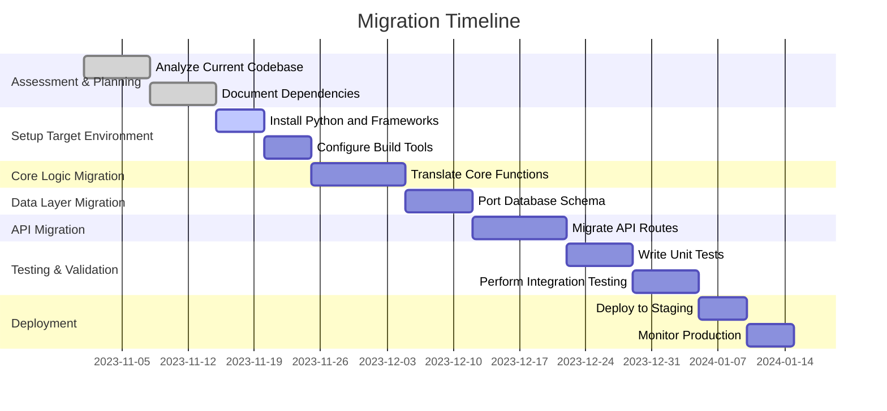

# MIGRATION_PLAN.md

## Executive Summary

This document outlines the migration plan for transitioning the `repository` project from PHP to Python. The migration aims to modernize the codebase, improve maintainability, and leverage Python's rich ecosystem for the project's needs. The migration will be conducted in seven phases: Assessment, Environment Setup, Core Logic Migration, Data Layer Migration, API Migration, Testing & Validation, and Deployment. Each phase includes actionable tasks, risk assessments, timelines, and success criteria to ensure a smooth transition.

---

## Migration Strategy Overview

The migration strategy is incremental, with a focus on modularity and testing at every stage. The PHP system will coexist temporarily with the Python components during the migration to minimize downtime and risks. The key principles include:

1. **Backward Compatibility**: Ensure old and new systems can interoperate during the migration period.
2. **Incremental Delivery**: Migrate components incrementally, starting with core logic.
3. **Thorough Testing**: Validate functionality at every stage before proceeding.
4. **Rollback Readiness**: Include rollback procedures for each milestone.

---

## Migration Phases

### Step 1: Assessment & Planning

#### Objectives
- Analyze the current PHP codebase.
- Identify dependencies, critical modules, and architectural patterns.
- Define a detailed timeline and milestones.

#### Tasks
1. Document the current architecture, including system diagrams and workflows.
2. List all third-party dependencies and assess their Python equivalents.
3. Identify critical components such as APIs, business logic, and database interactions.
4. Develop a high-level migration strategy.

#### Technical Requirements
- Access to the current repository and infrastructure.
- Tools: Dependency scanning tools (e.g., Composer for PHP), architecture documentation tools.

#### Risk Assessment
| **Risk**                  | **Impact** | **Likelihood** | **Mitigation** |
|---------------------------|------------|----------------|----------------|
| Missing documentation     | High       | Medium         | Interview developers and analyze code. |
| Dependency incompatibility| High       | Low            | Research Python equivalents and validate early. |

#### Deliverables
- Complete architecture documentation.
- List of PHP dependencies and their Python equivalents.
- Detailed migration timeline.

---

### Step 2: Setup Target Environment

#### Objectives
- Configure a Python development environment with necessary tools and libraries.

#### Tasks
1. Install Python and relevant frameworks (e.g., Flask/Django).
2. Set up the project structure (e.g., `src/`, `tests/`, `docs/`).
3. Configure build tools (e.g., `pip`, `virtualenv`, `poetry`).

#### Technical Requirements
- Python 3.10 (or higher).
- Development tools: `pytest`, `black` (formatter), `flake8` (linter).

#### Risk Assessment
| **Risk**         | **Impact** | **Likelihood** | **Mitigation** |
|------------------|------------|----------------|----------------|
| Incorrect setup  | Medium     | Low            | Validate with small test scripts. |

#### Deliverables
- Python development environment.
- Project skeleton with placeholder modules.

---

### Step 3: Core Logic Migration

#### Objectives
- Convert core business logic from PHP to Python.

#### Tasks
1. Translate core PHP functions into Python.
2. Adapt PHP data structures (e.g., associative arrays) to Python equivalents (e.g., dictionaries).
3. Port algorithms, ensuring accuracy and efficiency.

#### Code Example
**PHP:**
```php
function calculateDistance($lat1, $lon1, $lat2, $lon2) {
    // Haversine formula
    $earthRadius = 6371;
    ...
}
```

**Python:**
```python
def calculate_distance(lat1, lon1, lat2, lon2):
    # Haversine formula
    earth_radius = 6371
    ...
```

#### Technical Requirements
- Python libraries: `math`, `numpy` (if applicable).

#### Risk Assessment
| **Risk**                  | **Impact** | **Likelihood** | **Mitigation** |
|---------------------------|------------|----------------|----------------|
| Logical discrepancies      | High       | Medium         | Write unit tests for each function. |

#### Deliverables
- Python modules implementing core logic.
- Unit tests for each module.

---

### Step 4: Data Layer Migration

#### Objectives
- Migrate the database schema and queries to Python ORM.

#### Tasks
1. Convert the database schema to a format compatible with Python ORM (e.g., SQLAlchemy/Django ORM).
2. Adapt database queries to ORM methods.
3. Migrate the data access layer.

#### Technical Requirements
- Python ORM: SQLAlchemy or Django ORM.
- Access to the current database.

#### Risk Assessment
| **Risk**               | **Impact** | **Likelihood** | **Mitigation** |
|------------------------|------------|----------------|----------------|
| Schema incompatibility | High       | Low            | Test schema migrations on staging. |

#### Deliverables
- Python ORM models.
- Updated database queries.

---

### Step 5: API/Interface Migration

#### Objectives
- Convert API routes and middleware from PHP to Python.

#### Tasks
1. Migrate API routes to a Python web framework (e.g., Flask/Django).
2. Convert request/response handlers.
3. Rewrite middleware for authentication, logging, etc.

#### Technical Requirements
- Python web framework (Flask/Django).
- Tools: Postman for API testing.

#### Deliverables
- Python-based API endpoints.
- Middleware for common functionality.

---

### Step 6: Testing & Validation

#### Objectives
- Ensure the migrated system functions as expected.

#### Tasks
1. Write unit tests for all modules.
2. Perform integration testing between components.
3. Conduct performance benchmarking.

#### Technical Requirements
- Testing tools: `pytest`, `unittest`.

#### Risk Assessment
| **Risk**        | **Impact** | **Likelihood** | **Mitigation** |
|-----------------|------------|----------------|----------------|
| Missed bugs     | High       | Medium         | Comprehensive test coverage. |

#### Deliverables
- Test suite with 90%+ coverage.
- Benchmark results.

---

### Step 7: Deployment & Monitoring

#### Objectives
- Deploy the Python application and monitor for issues.

#### Tasks
1. Set up CI/CD pipeline using tools like GitHub Actions or Jenkins.
2. Deploy to staging and then production.
3. Monitor application performance and logs.

#### Technical Requirements
- CI/CD tools: GitHub Actions, Docker, Kubernetes (if applicable).

#### Risk Assessment
| **Risk**         | **Impact** | **Likelihood** | **Mitigation** |
|------------------|------------|----------------|----------------|
| Deployment failure | High      | Low            | Rollback procedures in place. |

#### Deliverables
- CI/CD pipeline.
- Production-ready Python application.

---

## Timeline and Milestones



---

## Resource Requirements

- 2 Python developers (migration and testing).
- 1 DevOps engineer (CI/CD, deployment).
- 1 Project manager.

---

## Success Criteria and Metrics

- 100% feature parity between PHP and Python versions.
- 90%+ test coverage.
- No critical bugs in production after 30 days.
- Performance benchmarks met or exceeded.

---

## Rollback Procedures

- Maintain separate PHP and Python branches in version control.
- Use feature flags to toggle between PHP and Python implementations.
- Backup databases before migrations.

---

## Post-Migration Validation Checklist

- [ ] All tests pass.
- [ ] Performance benchmarks met.
- [ ] Logs show no critical errors.
- [ ] User feedback collected and addressed.

--- 

This plan ensures a structured, low-risk migration to Python while maintaining the system's integrity and performance.