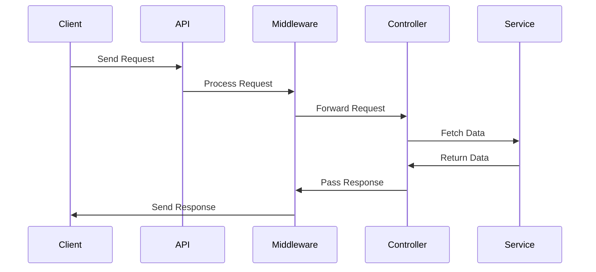

# Migration Step 5: API/Interface Migration

---

## **Step Overview and Objectives**

The goal of this step is to migrate your application’s API endpoints and routing logic from PHP to Python. This involves converting PHP-based API routes, request/response handlers, and middleware to Python equivalents. The migration will ensure that your API functions seamlessly in the new Python-based backend.

By the end of this step, your API should:
- Replicate the functionality of the original system.
- Integrate seamlessly with new or existing Python services.
- Be tested to ensure stability and correctness.

---

## **Prerequisites and Dependencies**

Before starting, ensure the following:

1. **Environment Setup**:
   - Python 3.9+ installed on your system.
   - A Python web framework like Flask, FastAPI, or Django installed (`pip install flask` or `pip install fastapi`).

2. **Repository Access**:
   - Access to the PHP source code repository to extract route definitions and logic.
   - A Python repository initialized to house the new API.

3. **Dependencies**:
   - Install necessary middleware and libraries. Example: For FastAPI, install `fastapi`, `uvicorn`, and `pydantic`.
     ```bash
     pip install fastapi uvicorn pydantic
     ```

4. **Data Contracts**:
   - A clear understanding of the API’s request parameters and response structures. Use tools like OpenAPI or Postman to document current API behavior.

5. **Database Migration**:
   - Ensure database models are already migrated to Python (if applicable).

6. **Testing Tools**:
   - Tools like `pytest`, `unittest`, or Postman for API testing.

---

## **Detailed Implementation Instructions**

### **1. Port API Routes**

#### **Extract Routes from PHP**
1. Locate the routes file in the PHP codebase (e.g., `routes.php` or `api.php`).
   ```php
   // Example PHP route
   Route::get('/users', 'UserController@getAllUsers');
   ```
2. Document all routes, including HTTP methods, paths, route parameters, and associated controllers.

#### **Define Routes in Python**
1. Choose a Python framework (e.g., FastAPI).
2. Create the equivalent route definitions using Python syntax.

   **Example**:
   PHP Route:
   ```php
   Route::get('/users/{id}', 'UserController@getUserById');
   ```

   Python (FastAPI):
   ```python
   from fastapi import FastAPI

   app = FastAPI()

   @app.get("/users/{id}")
   async def get_user_by_id(id: int):
       # Logic to fetch user by ID
       return {"user_id": id}
   ```

#### **Tips**:
- Maintain consistent route structures to minimize changes for front-end consumers.
- Use Python type hints for request parameters.

---

### **2. Convert Request/Response Handlers**

#### **PHP Example**
```php
class UserController {
    public function getUserById($id) {
        $user = User::find($id);
        return response()->json($user);
    }
}
```

#### **Python Conversion**
1. Create a controller or service file for handling business logic:
   ```python
   from fastapi import HTTPException

   def get_user_by_id_service(id: int):
       user = {"id": id, "name": "John Doe"}  # Replace with DB query
       if not user:
           raise HTTPException(status_code=404, detail="User not found")
       return user
   ```

2. Connect the route to the handler:
   ```python
   @app.get("/users/{id}")
   async def get_user_by_id(id: int):
       return get_user_by_id_service(id)
   ```

#### **Info**:
- Use Python’s `pydantic` library for request/response validation.
- Return JSON responses in Python using dictionaries or `JSONResponse`.

---

### **3. Adapt Middleware**

Middleware handles tasks like authentication, logging, and request transformation.

#### **PHP Middleware Example**
```php
class AuthMiddleware {
    public function handle($request, Closure $next) {
        if (!$request->header('Authorization')) {
            return response('Unauthorized', 401);
        }
        return $next($request);
    }
}
```

#### **Python Middleware Example**
FastAPI Middleware:
```python
from fastapi import Request
from fastapi.middleware.base import BaseHTTPMiddleware

class AuthMiddleware(BaseHTTPMiddleware):
    async def dispatch(self, request: Request, call_next):
        if "Authorization" not in request.headers:
            return JSONResponse(status_code=401, content={"detail": "Unauthorized"})
        return await call_next(request)

app.add_middleware(AuthMiddleware)
```

---

## **Code Examples and Snippets**

### **Example API Endpoint**
```python
from fastapi import FastAPI, HTTPException

app = FastAPI()

# Sample database
users_db = {1: {"id": 1, "name": "John Doe"}, 2: {"id": 2, "name": "Jane Doe"}}

@app.get("/users/{id}")
async def get_user_by_id(id: int):
    user = users_db.get(id)
    if not user:
        raise HTTPException(status_code=404, detail="User not found")
    return user
```

---

## **Common Pitfalls and How to Avoid Them**

1. **Inconsistent Route Naming**:
   - Ensure route names and structures remain consistent between PHP and Python.
   - Use tools like Postman Collections to verify.

2. **Improper Error Handling**:
   - Use Python’s `HTTPException` to handle errors gracefully.
   - Return meaningful error messages for debugging.

3. **Overlooking Middleware**:
   - Ensure all middleware (e.g., CORS, authentication) is ported and tested.

4. **Request/Response Validation**:
   - Leverage `pydantic` for schema validation to avoid runtime errors.

---

## **Testing Checklist**

1. **Unit Tests**:
   - Write unit tests for each endpoint using `pytest` or `unittest`.

2. **Integration Tests**:
   - Use Postman or `pytest` to test end-to-end API functionality.

3. **Automated Tests**:
   - Automate tests for all routes using a framework like `pytest`.

4. **Validation**:
   - Verify request and response structures match the original API.

---

## **Validation Criteria**

- All routes respond as expected with correct HTTP status codes.
- Middleware works without breaking the request flow.
- Request and response formats align with the original API.

---

## **Troubleshooting Guide**

### **Issue 1**: Routes not found in Python
- **Solution**: Check route definitions and ensure they are registered in the main application.

### **Issue 2**: Middleware not applied
- **Solution**: Confirm middleware is added using `app.add_middleware()`.

### **Issue 3**: Incorrect data types for request parameters
- **Solution**: Use Python type hints and validate with `pydantic`.

---

## **Resources and References**

1. **FastAPI Documentation**: [https://fastapi.tiangolo.com/](https://fastapi.tiangolo.com/)
2. **Flask Documentation**: [https://flask.palletsprojects.com/](https://flask.palletsprojects.com/)
3. **Postman**: [https://www.postman.com/](https://www.postman.com/)

---

## **Next Steps**

1. Migrate authentication and authorization mechanisms (if applicable).
2. Implement logging and monitoring for your Python API.
3. Deploy the API to a staging environment and perform load testing.

---

### Diagram: Request Flow (Mermaid)


**Estimated Time**: 3-5 days depending on API complexity.