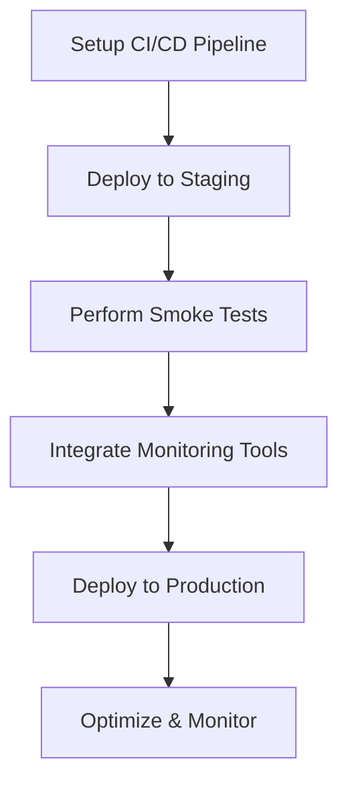

# Migration Step 7: Deployment & Monitoring - Detailed Guide

---

### **Step Overview & Objectives**

The objective of this step is to successfully deploy the migrated Python application to production while ensuring robust monitoring and optimization mechanisms are in place. By the end of this step, the Python application will replace the PHP application in production, with continuous integration and deployment (CI/CD) pipelines fully configured, staging environments validated, and monitoring systems active for real-time feedback.

---

### **Prerequisites & Dependencies**

Before proceeding, ensure the following prerequisites are met:

1. **Codebase**:
   - The Python application is complete and stored in the designated `repository`.
   - Unit, integration, and end-to-end tests have been successfully executed.

2. **Infrastructure**:
   - Access to staging and production servers.
   - A containerized environment (e.g., Docker) is set up if applicable.
   - Cloud provider tools (e.g., AWS, Google Cloud, Azure) are configured.

3. **Monitoring Tools**:
   - New Relic, Prometheus, Grafana, or other monitoring systems.
   - Log aggregation tools like ELK Stack or Splunk.

4. **CI/CD Pipeline**:
   - CI/CD platform is chosen and available (e.g., GitHub Actions, CircleCI, Jenkins, GitLab CI/CD).
   - Repository permissions are granted.

5. **Environment Variables**:
   - Ensure staging and production configurations (e.g., database credentials, API keys) are securely stored in environment variables.

---

### **Detailed Implementation Instructions**

#### **Task 1: Setup CI/CD**

##### **Step 1.1: Define CI/CD Pipeline**
Create CI/CD workflows for automated testing, building, and deployment. Here's an example using GitHub Actions:

```yaml
name: Python CI/CD Pipeline

on:
  push:
    branches:
      - main
  pull_request:
    branches:
      - main

jobs:
  test:
    runs-on: ubuntu-latest
    steps:
      - name: Check out code
        uses: actions/checkout@v3

      - name: Setup Python
        uses: actions/setup-python@v4
        with:
          python-version: 3.10

      - name: Install dependencies
        run: |
          python -m pip install --upgrade pip
          pip install -r requirements.txt

      - name: Run tests
        run: pytest --verbose

  deploy:
    if: github.ref == 'refs/heads/main'
    runs-on: ubuntu-latest
    needs: test
    steps:
      - name: Check out code
        uses: actions/checkout@v3

      - name: Build Docker image
        run: |
          docker build -t python-app:$GITHUB_SHA .

      - name: Push Docker image to registry
        env:
          DOCKER_USERNAME: ${{ secrets.DOCKER_USERNAME }}
          DOCKER_PASSWORD: ${{ secrets.DOCKER_PASSWORD }}
        run: |
          echo $DOCKER_PASSWORD | docker login -u $DOCKER_USERNAME --password-stdin
          docker push python-app:$GITHUB_SHA

      - name: Deploy to staging
        run: |
          ssh user@staging-server "docker pull python-app:$GITHUB_SHA && docker run -d -p 80:80 python-app:$GITHUB_SHA"
```

##### **Step 1.2: Configure Environment Variables**
Securely store sensitive values such as database credentials and API keys using GitHub Secrets or similar tools.

---

#### **Task 2: Deploy to Staging**

##### **Step 2.1: Verify Staging Environment**
Ensure the environment mirrors production as closely as possible, with identical configurations and dependencies.

##### **Step 2.2: Deploy Application**
Run the CI/CD pipeline to deploy the Python application to staging. Validate its functionality using predefined testing criteria (see **Testing Checklist** below).

Example deployment command via SSH:

```bash
ssh user@staging-server "docker pull python-app:$GITHUB_SHA && docker run -d -p 80:80 python-app:$GITHUB_SHA"
```

##### **Step 2.3: Conduct Smoke Tests**
Perform basic tests to confirm the application is running and accessible:
```bash
curl -X GET http://staging-server/api/healthcheck
```

---

#### **Task 3: Monitor and Optimize**

##### **Step 3.1: Integrate Monitoring Tools**
Set up monitoring tools to track performance metrics, logs, and errors.

Example: Configure **Prometheus** for application metrics:
```python
from prometheus_client import start_http_server, Counter

REQUEST_COUNT = Counter('request_count', 'Total HTTP requests')

def handle_request():
    REQUEST_COUNT.inc()
    # Application logic here

if __name__ == "__main__":
    start_http_server(8000)
    while True:
        handle_request()
```

##### **Step 3.2: Define Alerts**
Set up alerting rules for critical metrics such as CPU usage, memory consumption, or error rates. Example Prometheus alert:
```yaml
groups:
  - name: cpu_usage_alert
    rules:
      - alert: HighCPUUsage
        expr: process_cpu_seconds_total > 0.85
        for: 2m
        labels:
          severity: critical
        annotations:
          summary: High CPU usage detected
          description: CPU usage exceeded 85% for 2 minutes.
```

##### **Step 3.3: Analyze Logs**
Aggregate logs using tools like ELK Stack or Splunk for debugging and performance optimization.

---

### **Code Examples and Snippets**

1. **Dockerfile**:
```dockerfile
FROM python:3.10-slim

WORKDIR /app

COPY requirements.txt requirements.txt
RUN pip install -r requirements.txt

COPY . .

CMD ["gunicorn", "app:app", "--bind", "0.0.0.0:80"]
```

2. **Health Check Endpoint**:
```python
from flask import Flask, jsonify

app = Flask(__name__)

@app.route('/api/healthcheck', methods=['GET'])
def healthcheck():
    return jsonify({'status': 'healthy'})

if __name__ == "__main__":
    app.run(host='0.0.0.0', port=80)
```

---

### **Common Pitfalls and How to Avoid Them**

1. **Incomplete Staging Configurations**:
   - Ensure staging mirrors production (e.g., database version, environment variables).
   - Use infrastructure-as-code tools like Terraform to automate configuration.

2. **Insufficient Monitoring**:
   - Use dashboards in tools like Grafana to visualize all critical metrics.
   - Regularly test alerting systems.

3. **Unoptimized CI/CD Pipeline**:
   - Optimize pipeline steps to minimize deployment time.
   - Cache dependencies where possible.

---

### **Testing Checklist**

1. Verify API endpoints are functional.
2. Confirm database connections are established.
3. Check application logs for errors or warnings.
4. Validate monitoring metrics.
5. Perform load testing using tools like Apache JMeter.

---

### **Validation Criteria**

- Application successfully deployed to staging and production.
- Monitoring tools are active and tracking metrics.
- No critical errors observed in logs.
- Performance is within acceptable thresholds.

---

### **Troubleshooting Guide**

| **Issue**                  | **Resolution**                                                                 |
|----------------------------|-------------------------------------------------------------------------------|
| Application fails to start | Check logs for missing dependencies or configuration issues.                  |
| Healthcheck fails          | Verify database connections and environment variables.                       |
| High error rates           | Review logs and metrics to identify problematic endpoints or services.        |

---

### **Resources & References**

- [GitHub Actions Documentation](https://docs.github.com/en/actions)
- [Docker Documentation](https://docs.docker.com/)
- [Prometheus Documentation](https://prometheus.io/docs/)
- [Grafana Documentation](https://grafana.com/docs/)
- [Flask Documentation](https://flask.palletsprojects.com/)

---

### **Next Steps**

1. Refine monitoring dashboards based on production feedback.
2. Plan regular maintenance windows for optimizations.
3. Begin decommissioning legacy PHP infrastructure.

---

### **Time Estimates**

- CI/CD Setup: 3-4 hours
- Staging Deployment: 2-3 hours
- Monitoring Integration: 2-4 hours
- Optimization & Validation: 3-5 hours

---



This guide provides actionable steps for developers to deploy and monitor the migrated Python application successfully.